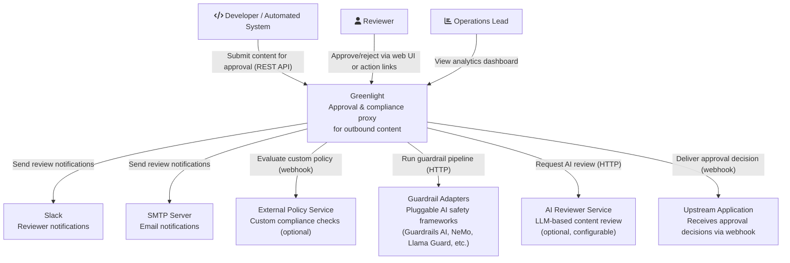
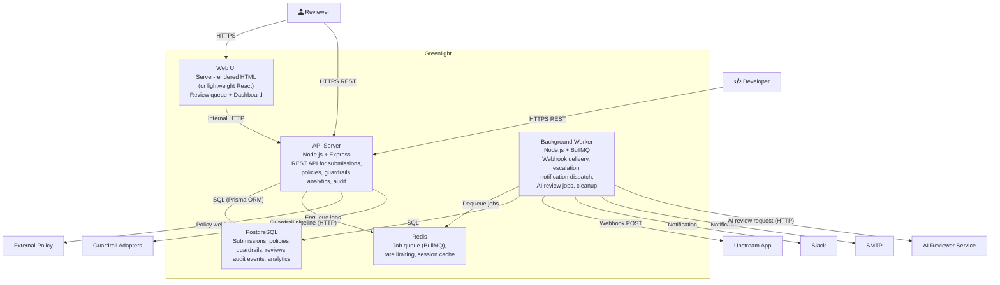
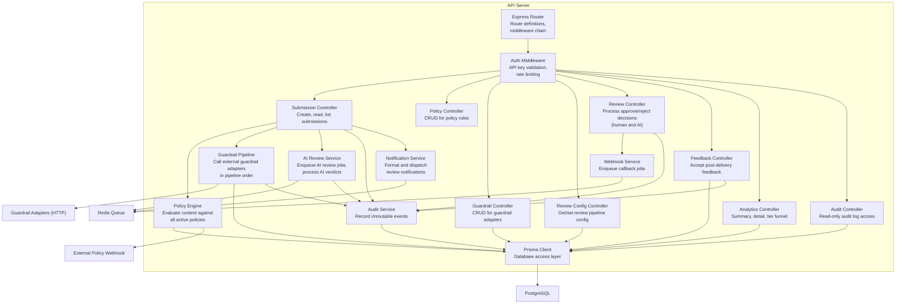
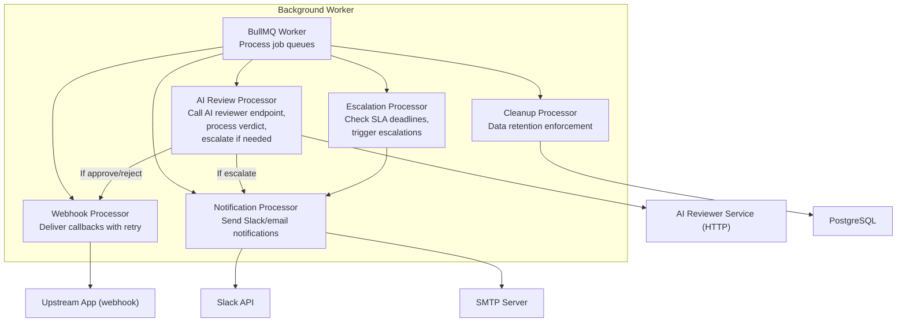

# C4 Architecture -- Greenlight

## Level 1: System Context

Who uses the system and what external systems does it interact with?

### Context Notes

- **Greenlight**: A self-hosted approval proxy that intercepts outbound content, evaluates it against configurable policies, runs it through an optional guardrail pipeline, optionally gets an AI-based review, routes items needing human review to reviewers, records every decision for audit and analytics, and notifies the upstream system of the outcome.
- **Slack / SMTP**: Notification channels for reviewer alerts. Greenlight does not require either -- they are optional integrations. The web UI serves as a fallback.
- **External Policy Service**: An optional webhook that Greenlight calls during policy evaluation for custom compliance logic (e.g., a company's internal compliance API). Greenlight functions fully without this.
- **Guardrail Adapters**: Optional external AI safety services registered via the `/api/v1/guardrails` endpoint. Greenlight calls each adapter in pipeline order using a standard HTTP contract. Adapters can wrap any guardrail framework (Guardrails AI, NVIDIA NeMo Guardrails, Meta Llama Guard, OpenAI Moderation, IBM Granite Guardian, or custom implementations). Each adapter returns a structured verdict (pass/fail/flag with confidence and reasoning).
- **AI Reviewer Service**: An optional LLM-based reviewer that evaluates content against policies using natural language understanding. Configured via `/api/v1/review-config`. Uses the same HTTP adapter contract as guardrails. In `ai_then_human` mode, the AI reviewer makes the first decision and escalates to human reviewers when confidence is below threshold.
- **Upstream Application**: The system that submitted content for approval. Receives the decision via webhook callback. If no callback URL is provided, the submitter must poll for the decision.

## Level 2: Container Diagram

What are the major runtime components?

### Container Notes

| Container | Technology | Purpose | Scales How |
|-----------|-----------|---------|-----------|
| API Server | Node.js 20+, Express, TypeScript | Handles all REST API requests: submissions, policy CRUD, guardrail CRUD, review config, analytics queries, audit log, health check. Runs synchronous guardrail pipeline during submission. | Horizontal (stateless, load balancer) |
| Background Worker | Node.js 20+, BullMQ, TypeScript | Processes async jobs: webhook delivery with retries, escalation timers, notification dispatch, AI review requests, data retention cleanup | Horizontal (BullMQ worker scaling) |
| Web UI | Server-rendered HTML or lightweight React SPA | Review queue for human reviewers, analytics dashboard (including AI review stats and tier funnel) for ops. Talks to API server. | Served by API server (single process) or separate static host |
| PostgreSQL | PostgreSQL 15+ | Stores all persistent data: submissions, policies, guardrails, guardrail evaluations, reviews (human + AI), feedback, audit events, review config. Partitioned audit table. | Vertical (single instance for SMB scale) |
| Redis | Redis 7+ | BullMQ job queue for async processing (webhooks, notifications, AI review jobs). Rate limiting counters. Optional session/cache. | Single instance (SMB scale) |

## Level 3: Component Diagram

### API Server Components

### Component Notes

| Component | Responsibility | Key Interfaces |
|-----------|---------------|---------------|
| Express Router | Maps HTTP methods+paths to controllers, applies middleware | All `/api/v1/*` routes, `/health`, `/review`, `/dashboard` |
| Auth Middleware | Validates API key from `Authorization` header, enforces rate limits | `req.apiKey` populated for downstream controllers |
| Policy Engine | Loads active policies, evaluates content against each in priority order, returns aggregated results | `evaluate(content, channel, contentType) -> PolicyResult[]` |
| Guardrail Pipeline | Loads active guardrails in pipeline order, calls each adapter endpoint, aggregates verdicts. Short-circuits on `fail` from `fail_closed` adapters. Records evaluations. | `evaluateGuardrails(submission) -> GuardrailResult[]` |
| AI Review Service | Manages AI-based review. Enqueues AI review jobs via BullMQ. Processes AI verdicts (approve/reject/escalate). Escalates to human review when confidence is below threshold. | `requestAIReview(submission) -> void`, `processAIVerdict(submissionId, verdict) -> void` |
| Notification Service | Formats review request notifications for Slack (Block Kit) and email (HTML), enqueues via BullMQ | `notifyReviewers(submission, policyResults) -> void` |
| Webhook Service | Enqueues webhook delivery jobs with retry config | `deliverDecision(submission, decision) -> void` |
| Audit Service | Writes immutable audit events to the audit_event table. Tracks actor type (human/ai/system/guardrail). | `record(eventType, submissionId, actor, actorType, payload) -> void` |
| Prisma Client | Type-safe database access for all entities | Auto-generated from Prisma schema |

### Background Worker Components

## Key Decisions

| Decision | Rationale | Alternative Considered |
|----------|-----------|----------------------|
| PostgreSQL over SQLite | Analytics queries on 100k+ rows need proper indexing, partitioning, and aggregate functions. SQLite would bottleneck at scale. | SQLite for simplicity -- rejected because analytics is a core feature |
| BullMQ over in-process queue | Webhook retries and escalation timers need persistence across restarts. BullMQ provides reliable delayed jobs, retries, and dead-letter queues. | In-process setTimeout -- rejected because jobs lost on restart |
| Prisma ORM over raw SQL | Type-safe queries, auto-generated migrations, schema-as-code. Reduces bugs in data access layer. | Knex.js -- viable but less type safety. Drizzle -- newer, less ecosystem. |
| Express over Fastify | Larger middleware ecosystem, more familiar to contributors, easier to hire for. Performance difference negligible at SMB scale. | Fastify for raw speed -- rejected because adoption matters more than throughput for an open-source project |
| Server-rendered HTML for Web UI (initial) | Minimal client-side JS, fastest to build, no build step for UI. Can migrate to React SPA later if needed. | React SPA -- rejected for v1 because it adds build complexity and is overkill for 3 screens |
| API keys over OAuth/JWT for auth | Simplest integration path for developers. No OAuth setup. API keys are the standard for developer tools. | JWT -- adds complexity. OAuth -- overkill for single-tenant v1. |
| Pluggable guardrail adapters over built-in AI integration | Greenlight defines a standard HTTP adapter contract for guardrails. Operators bring their own guardrail framework (Guardrails AI, NeMo, Llama Guard, OpenAI, etc.) and wrap it in the adapter contract. Avoids provider lock-in, keeps Greenlight dependency-light, and lets the guardrail ecosystem evolve independently. | Built-in LLM SDK integration -- rejected because it couples Greenlight to specific providers and bloats the dependency tree. |
| AI review as async job (BullMQ) over sync in request path | AI review can take 2-15s depending on the model and service. Running it synchronously would block the submission response. Enqueuing as a BullMQ job keeps submission response fast (returns `pending`) and processes the AI review asynchronously. | Sync AI review -- rejected because LLM latency would violate the < 200ms auto-approve SLA for the policy-only path, and even for AI-review submissions the caller should not block. |
| Tiered evaluation pipeline (rules -> guardrails -> AI -> human) | Each tier is progressively more expensive and slower. Rules are milliseconds and free. Guardrails are seconds and cheap. AI review is seconds and moderate cost. Human review is minutes/hours and most expensive. The pipeline short-circuits as early as possible to minimize cost and latency. | Flat policy evaluation (all checks in parallel) -- rejected because it wastes expensive AI calls on submissions that cheap rules would have already approved/rejected. |
| Guardrail pipeline evaluated synchronously in submission path | Guardrail adapters have bounded timeouts (max 30s) and operators expect guardrail verdicts in the submission response. Running them synchronously keeps the programming model simple: the response includes all guardrail results. | Async guardrail evaluation -- rejected because callers need guardrail verdicts to decide whether to show "pending" or "rejected" status. |
