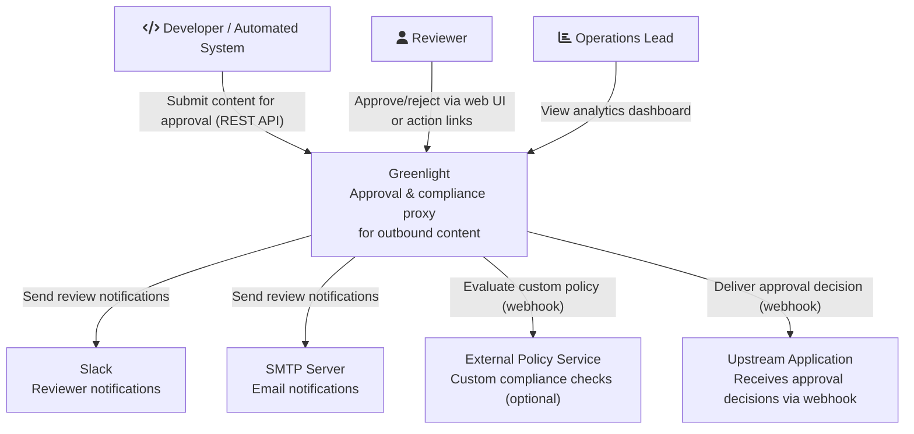
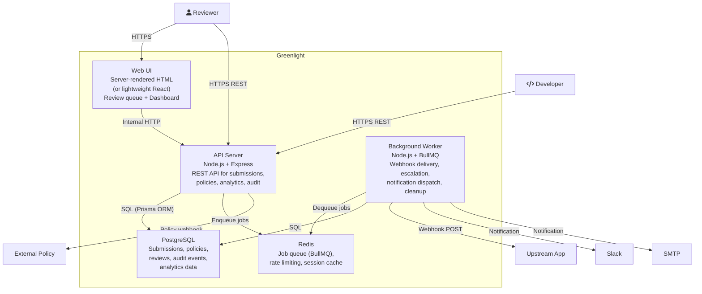
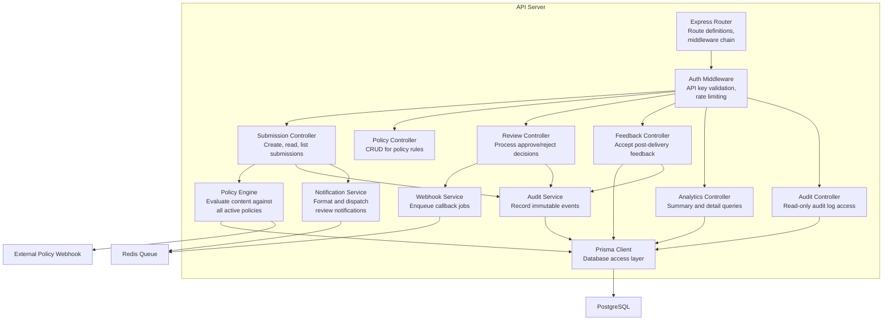
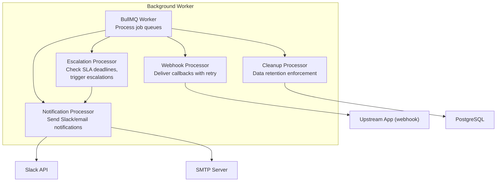

# C4 Architecture -- Greenlight

## Level 1: System Context

Who uses the system and what external systems does it interact with?

### Context Notes

- **Greenlight**: A self-hosted approval proxy that intercepts outbound content, evaluates it against configurable policies, routes items needing human review to reviewers, records every decision for audit and analytics, and notifies the upstream system of the outcome.
- **Slack / SMTP**: Notification channels for reviewer alerts. Greenlight does not require either -- they are optional integrations. The web UI serves as a fallback.
- **External Policy Service**: An optional webhook that Greenlight calls during policy evaluation for custom compliance logic (e.g., a company's internal compliance API). Greenlight functions fully without this.
- **Upstream Application**: The system that submitted content for approval. Receives the decision via webhook callback. If no callback URL is provided, the submitter must poll for the decision.

## Level 2: Container Diagram

What are the major runtime components?

### Container Notes

| Container | Technology | Purpose | Scales How |
|-----------|-----------|---------|-----------|
| API Server | Node.js 20+, Express, TypeScript | Handles all REST API requests: submissions, policy CRUD, analytics queries, audit log, health check | Horizontal (stateless, load balancer) |
| Background Worker | Node.js 20+, BullMQ, TypeScript | Processes async jobs: webhook delivery with retries, escalation timers, notification dispatch, data retention cleanup | Horizontal (BullMQ worker scaling) |
| Web UI | Server-rendered HTML or lightweight React SPA | Review queue for human reviewers, analytics dashboard for ops. Talks to API server. | Served by API server (single process) or separate static host |
| PostgreSQL | PostgreSQL 15+ | Stores all persistent data: submissions, policies, reviews, feedback, audit events. Partitioned audit table. | Vertical (single instance for SMB scale) |
| Redis | Redis 7+ | BullMQ job queue for async processing. Rate limiting counters. Optional session/cache. | Single instance (SMB scale) |

## Level 3: Component Diagram

### API Server Components

### Component Notes

| Component | Responsibility | Key Interfaces |
|-----------|---------------|---------------|
| Express Router | Maps HTTP methods+paths to controllers, applies middleware | All `/api/v1/*` routes, `/health`, `/review`, `/dashboard` |
| Auth Middleware | Validates API key from `Authorization` header, enforces rate limits | `req.apiKey` populated for downstream controllers |
| Policy Engine | Loads active policies, evaluates content against each in priority order, returns aggregated results | `evaluate(content, channel, contentType) -> PolicyResult[]` |
| Notification Service | Formats review request notifications for Slack (Block Kit) and email (HTML), enqueues via BullMQ | `notifyReviewers(submission, policyResults) -> void` |
| Webhook Service | Enqueues webhook delivery jobs with retry config | `deliverDecision(submission, decision) -> void` |
| Audit Service | Writes immutable audit events to the audit_event table | `record(eventType, submissionId, actor, payload) -> void` |
| Prisma Client | Type-safe database access for all entities | Auto-generated from Prisma schema |

### Background Worker Components

## Key Decisions

| Decision | Rationale | Alternative Considered |
|----------|-----------|----------------------|
| PostgreSQL over SQLite | Analytics queries on 100k+ rows need proper indexing, partitioning, and aggregate functions. SQLite would bottleneck at scale. | SQLite for simplicity -- rejected because analytics is a core feature |
| BullMQ over in-process queue | Webhook retries and escalation timers need persistence across restarts. BullMQ provides reliable delayed jobs, retries, and dead-letter queues. | In-process setTimeout -- rejected because jobs lost on restart |
| Prisma ORM over raw SQL | Type-safe queries, auto-generated migrations, schema-as-code. Reduces bugs in data access layer. | Knex.js -- viable but less type safety. Drizzle -- newer, less ecosystem. |
| Express over Fastify | Larger middleware ecosystem, more familiar to contributors, easier to hire for. Performance difference negligible at SMB scale. | Fastify for raw speed -- rejected because adoption matters more than throughput for an open-source project |
| Server-rendered HTML for Web UI (initial) | Minimal client-side JS, fastest to build, no build step for UI. Can migrate to React SPA later if needed. | React SPA -- rejected for v1 because it adds build complexity and is overkill for 3 screens |
| API keys over OAuth/JWT for auth | Simplest integration path for developers. No OAuth setup. API keys are the standard for developer tools. | JWT -- adds complexity. OAuth -- overkill for single-tenant v1. |
