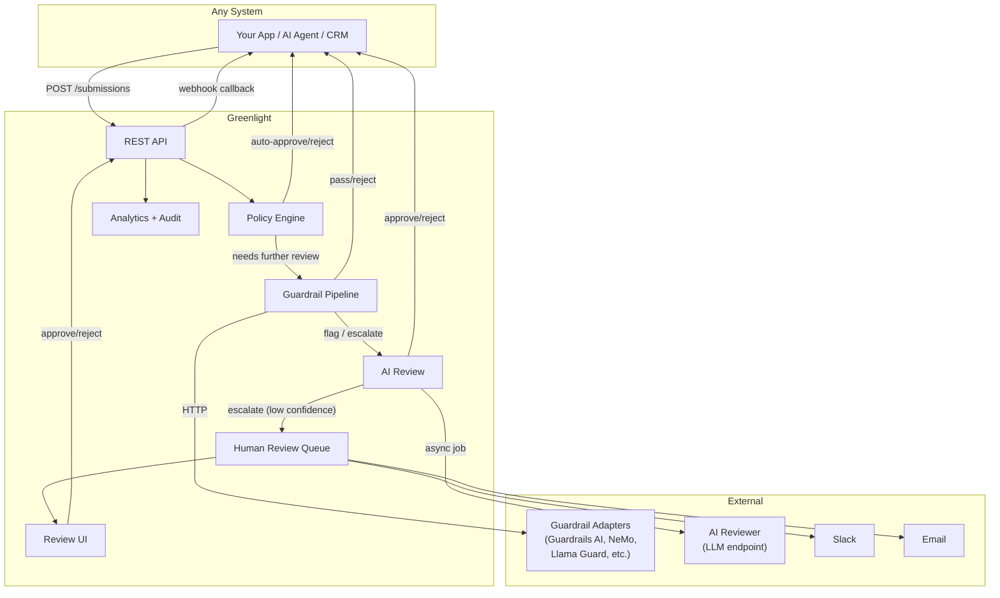

# Executive Brief -- Greenlight

> **Status:** Awaiting approval
> **Autonomy level:** Standard
> **Created:** 2026-04-05
> **Project type:** api-service
> **Project traits:** has-auth, has-database, has-ai-integration, has-mobile-viewport

## What We Think You Want

You want an open-source service that acts as the universal approval checkpoint for any outbound content -- whether generated by AI or written by humans. Any developer building a workflow that sends emails, messages, documents, or notifications should be able to drop in Greenlight with a single API call to get approval before anything goes out. It should be pluggable (works with any stack), store analytics on approval patterns, and capture feedback on what happens after delivery -- making it smarter over time.

Critically, the approval flow should not be limited to "rules then human." AI-powered review (using LLMs to evaluate content against policies) should be a first-class capability -- approvals can be made by AI, by humans, or AI-first-then-human-if-flagged. And external AI guardrail frameworks (Guardrails AI, NeMo Guardrails, Llama Guard, OpenAI Moderation, etc.) should be pluggable as additional review steps, not an afterthought.

This should be a no-brainer adoption for any SMB or developer who needs an approval layer without the weight of enterprise workflow engines.

## What We Will Build

- **REST API** -- a single endpoint (`POST /api/v1/submissions`) where any system submits content for approval and gets back an instant decision (auto-approve/reject) or a pending status for further review
- **Configurable policy engine** -- built-in rules (regex, keyword blocklist, content length, required fields) plus custom webhook policies for external compliance checks
- **Pluggable guardrail pipeline** -- register external AI guardrail frameworks (Guardrails AI, NeMo Guardrails, Llama Guard, OpenAI Moderation, or any custom service) as additional review steps via a standard HTTP adapter contract. Multiple guardrails can be chained in a configurable pipeline.
- **AI-powered review** -- configurable LLM-based content review that can approve, reject, or escalate to human reviewers. Three review modes: `human_only`, `ai_only`, and `ai_then_human` (AI reviews first, escalates when confidence is below a configurable threshold).
- **Human review flow** -- notifications via Slack and email with one-click approve/reject action links, plus a minimal web UI as fallback
- **Tiered evaluation pipeline** -- submissions flow through four tiers: (1) rule-based policies, (2) external guardrail pipeline, (3) AI-based review, (4) human review. Each tier can auto-approve, auto-reject, or escalate to the next. Any tier can be disabled. The pipeline short-circuits early to minimize cost and latency.
- **Analytics API and dashboard** -- the dashboard shows six key views: total submissions, approval rate, average review time, SLA compliance, daily submission volume chart, top rejection reasons, and post-delivery feedback summary (positive/negative/neutral). The API exposes richer data including tier funnel metrics, AI review confidence distribution, and per-guardrail pass/fail stats for programmatic consumers.
- **Immutable audit trail** -- every submission, policy evaluation, guardrail verdict, AI review decision, human review decision, and feedback event logged with actor type (human/AI/system/guardrail) for compliance
- **Webhook callbacks** -- approved/rejected decisions delivered to the originating system with HMAC-signed webhooks and retry logic
- **Self-hostable** -- single Docker container + PostgreSQL + Redis, deployable in under 10 minutes

## Key Screen Preview

The review queue is the primary screen for human reviewers. Full wireframes for all three screens (Review Queue, Submission Detail with guardrail/AI review context, and Analytics Dashboard) are in the [UX Specification](../ux/ux-spec.md).

  

    <b>Greenlight</b>
    <a href="#" style="color:#8be9fd; text-decoration:none">Review</a> <a href="#" style="color:#ccc; text-decoration:none">Dashboard</a>
  

  

    

      <h2 style="margin:0">Pending Reviews 3</h2>
      <select style="padding:6px 12px; border:1px solid #ddd; border-radius:4px"><option>All channels</option></select>
    

    

      

        

          URGENT
          email &middot; 5 min ago
          
<b>Marketing newsletter Q2 launch</b>

          
Flagged: keyword_blocklist (contains "guaranteed returns")

        

        

          <button style="background:#51cf66; color:white; border:none; padding:8px 16px; border-radius:4px; cursor:pointer">Approve</button>
          <button style="background:#ff6b6b; color:white; border:none; padding:8px 16px; border-radius:4px; cursor:pointer">Reject</button>
        

      

    

    

      

        

          NORMAL
          slack &middot; 12 min ago
          
<b>Customer response -- refund request #4821</b>

          
Flagged: content_length (exceeds 2000 chars)

        

        

          <button style="background:#51cf66; color:white; border:none; padding:8px 16px; border-radius:4px; cursor:pointer">Approve</button>
          <button style="background:#ff6b6b; color:white; border:none; padding:8px 16px; border-radius:4px; cursor:pointer">Reject</button>
        

      

    

    

      

        

          NORMAL
          sms &middot; 28 min ago
          
<b>Appointment reminder batch (47 recipients)</b>

          
Flagged: custom_webhook (external compliance check inconclusive)

        

        

          <button style="background:#51cf66; color:white; border:none; padding:8px 16px; border-radius:4px; cursor:pointer">Approve</button>
          <button style="background:#ff6b6b; color:white; border:none; padding:8px 16px; border-radius:4px; cursor:pointer">Reject</button>
        

      

    

  

## What We Will NOT Build

- **Workflow engine** -- Greenlight is a single approval checkpoint, not a BPMN orchestrator. It does not chain multiple approval steps or manage multi-step processes.
- **Guardrails library itself** -- Greenlight does not ship its own AI safety classifiers, structural validators, or content moderation models. Instead, it provides a pluggable adapter interface so external guardrail frameworks (Guardrails AI, NeMo Guardrails, Llama Guard, OpenAI Moderation, etc.) can be wired in. Greenlight orchestrates the review pipeline; the guardrail implementation lives externally.
- **Delivery channel** -- Greenlight does not send emails, SMS, or messages. It approves/rejects content and notifies the originating system to proceed (or not).
- **Multi-tenant SaaS** -- v1 is single-tenant, self-hosted. Multi-tenancy, billing, and tenant isolation are deferred.
- **User management / SSO** -- v1 uses API keys. No user accounts, roles, or SSO in the first version.
- **Batch submissions** -- v1 handles one submission per request. Batch API deferred to v2.

## Top Risks

| Risk | Impact | Mitigation |
|------|--------|-----------|
| Low adoption because developers view approval as friction | Product fails to gain traction | Auto-approve path for low-risk items makes the happy path zero-friction. Tiered pipeline means most items never need human review -- rules and AI handle the bulk. |
| Webhook delivery failures leave items stuck in pending | Upstream systems hang waiting for decisions | 3-retry exponential backoff. SLA-based escalation. Dashboard shows stuck items. Polling fallback via GET endpoint. |
| Review notification fatigue causes reviewers to ignore approvals | Items pile up, SLAs breached | AI review tier absorbs routine decisions, reducing human review volume. Smart escalation. Priority levels. Analytics on reviewer response times. |
| AI reviewer inconsistency or hallucination leads to wrong approvals | Harmful content released | Configurable confidence threshold for AI-to-human escalation. `ai_then_human` mode as recommended default. Dashboard tracks AI vs human agreement rate. Full audit trail of every AI verdict. |
| External guardrail adapter failure blocks the pipeline | Submissions stuck or incorrectly processed | Per-adapter timeout and configurable failure mode (fail_open/fail_closed). Circuit breaker after consecutive failures. Dashboard tracks adapter health and latency. |
| Audit log unbounded growth degrades performance | Database slows down | Configurable retention policy. Audit table partitioned by month. Automated cleanup job. |
| API key compromise allows unauthorized content injection | Spam or malicious content approved | Key rotation support. Per-key rate limiting. Audit trail of all key usage. IP allowlisting in v2. |

## Recommended Approach

TypeScript on Node.js with Express for the API, BullMQ + Redis for reliable async job processing (webhooks, notifications, AI review jobs, escalation), PostgreSQL with Prisma ORM for type-safe data access and analytics queries, and server-rendered HTML for the minimal review UI and dashboard. This stack maximizes developer familiarity (TypeScript ecosystem), minimizes operational complexity (3 containers: app + Postgres + Redis), and supports the analytics workload that is central to Greenlight's value proposition.

AI guardrail integration uses a standard HTTP adapter contract -- Greenlight defines the request/response shape, and any guardrail framework (Guardrails AI, NeMo Guardrails, Llama Guard, OpenAI Moderation) is wrapped in a thin HTTP adapter that conforms to it. This keeps Greenlight dependency-free of any specific AI provider. AI-based review runs as a BullMQ async job to avoid blocking the submission response path. The project ships as a Docker Compose stack and an npm package for programmatic use.

## Estimated Scope

- **Issues:** ~16-20 implementation tasks
- **Complexity:** Medium-High
- **Estimated time:** 3-4 days (agent time)

## Detailed Docs

- [Research -- Knowledge Tree](../research/knowledge-tree.md)
- [Product Requirements (PRD)](../prd/project-prd.md)
- [UX Specification](../ux/ux-spec.md)
- [Architecture (C4)](../architecture/c4.md)

## Approval

- [ ] Human reviewed and approved
- [ ] Scope confirmed -- deliverables match expectations
- [ ] Non-goals acknowledged -- exclusions are acceptable
- [ ] Risks acknowledged -- mitigations are sufficient
