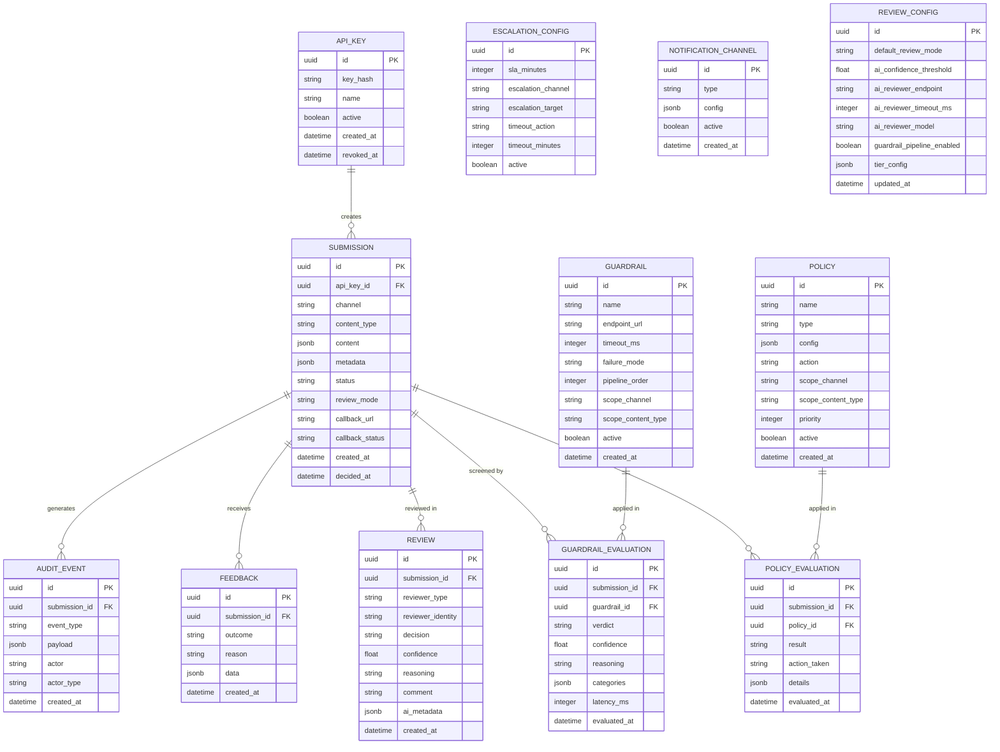

# Product Requirements -- Greenlight

## Overview

Greenlight is an open-source approval and compliance proxy for outbound content. It sits between any system that produces content (AI agents, CRMs, marketing tools, custom apps) and the delivery channel (email, SMS, Slack, API), intercepting items for automated policy checks and optional human review before release. It stores every decision for analytics, audit, and feedback. Targeted at SMBs and developers who need a no-brainer way to add approval workflows without deploying enterprise orchestration.

## Goals

1. **Provide a universal approval checkpoint** -- any system can submit content for approval via a single REST API call, and receive an approved/rejected decision via sync response or async webhook.
2. **Enable pluggable policy rules** -- ship with built-in rules (regex, keyword blocklist, content length, required fields) and support custom policies via webhook.
3. **Store analytics and feedback data** -- track approval rates, rejection reasons, latency, reviewer behavior, and expose this via API and a minimal dashboard.
4. **Be trivially adoptable** -- a developer should be able to go from `npm install` to first approval request in under 10 minutes with zero configuration beyond a database connection string.

## Non-Goals (Explicit Out of Scope)

- **Not a workflow engine** -- Greenlight does not orchestrate multi-step business processes. It is a single approval checkpoint, not a BPMN engine.
- **Not a guardrails library itself** -- Greenlight does not ship its own LLM safety classifiers or structural validators. Instead, it provides a pluggable guardrail adapter interface so external frameworks (Guardrails AI, NeMo Guardrails, Llama Guard, OpenAI Moderation, etc.) can be wired in as review steps. Greenlight is the orchestration point, not the guardrail implementation.
- **Not a delivery channel** -- Greenlight does not send emails, SMS, or messages. It approves/rejects content and calls back the originating system.
- **Not a user management system** -- Greenlight uses API keys for authentication and supports webhook-based reviewer notification. It does not manage user accounts, roles, or SSO (v1).
- **Not a multi-tenant SaaS platform** -- v1 is single-tenant, self-hosted. Multi-tenancy is deferred.

## User Stories

### Persona 1: Developer (integrating Greenlight into their app)

- **REQ-001** As a developer, I want to submit content for approval via a single POST request so that I can add approval to my workflow without changing my architecture.
  - Acceptance criteria:
    - [ ] `POST /api/v1/submissions` accepts a JSON payload with content, metadata, channel, and callback URL
    - [ ] Returns a submission ID and status (approved/pending/rejected) synchronously
    - [ ] If policies auto-approve, response is immediate with status `approved`
    - [ ] If human review is needed, response is `pending` with estimated review time

- **REQ-002** As a developer, I want to receive approval decisions via webhook so that my system can proceed when content is approved without polling.
  - Acceptance criteria:
    - [ ] Greenlight sends a POST to the callback URL with the decision (approved/rejected), reviewer info, and timestamp
    - [ ] Webhook includes HMAC signature for verification
    - [ ] Failed webhook deliveries are retried with exponential backoff (3 attempts)

- **REQ-003** As a developer, I want to configure policy rules via API so that I can automate content checks without human involvement for low-risk items.
  - Acceptance criteria:
    - [ ] `POST /api/v1/policies` creates a new policy rule
    - [ ] Policy types include: regex match, keyword blocklist, content length bounds, required metadata fields, custom webhook
    - [ ] Policies can be scoped to specific channels or content types
    - [ ] Policies can be set to `block` (reject on match), `flag` (require human review on match), or `info` (log only)

- **REQ-004** As a developer, I want to query the analytics API so that I can build dashboards or feed approval data back into my AI systems.
  - Acceptance criteria:
    - [ ] `GET /api/v1/analytics/summary` returns approval rate, average review time, rejection reasons breakdown, volume over time
    - [ ] `GET /api/v1/analytics/submissions` returns paginated submission history with filters (status, channel, date range, policy triggered)
    - [ ] All analytics endpoints support date range filtering

- **REQ-005** As a developer, I want to submit feedback on approved content after delivery so that I can close the feedback loop (e.g., "this email got a complaint" or "this post performed well").
  - Acceptance criteria:
    - [ ] `POST /api/v1/submissions/:id/feedback` accepts outcome data (positive/negative/neutral + freetext reason)
    - [ ] Feedback is linked to the original submission and visible in analytics
    - [ ] Feedback aggregates are available in the analytics summary (e.g., "12% of approved items received negative feedback")

- **REQ-006** As a developer, I want to authenticate with API keys so that I can secure my integration without complex OAuth setup.
  - Acceptance criteria:
    - [ ] API keys are created via CLI command or API endpoint
    - [ ] Every API request requires a valid `Authorization: Bearer <key>` header
    - [ ] Invalid/missing keys return 401
    - [ ] API keys can be revoked

### Persona 2: Reviewer (approving/rejecting content)

- **REQ-007** As a reviewer, I want to receive approval requests via email or Slack so that I can review content where I already work.
  - Acceptance criteria:
    - [ ] Greenlight sends notification to configured channel (email via SMTP, Slack via webhook) when a submission needs human review
    - [ ] Notification includes content preview, metadata, policy flags, and approve/reject action links
    - [ ] Action links are single-use, time-limited tokens

- **REQ-008** As a reviewer, I want to approve or reject a submission with an optional comment so that the originating system knows why.
  - Acceptance criteria:
    - [ ] `POST /api/v1/submissions/:id/review` accepts decision (approved/rejected) and optional comment
    - [ ] Decision triggers the callback webhook to the originating system
    - [ ] Decision is recorded in the audit trail with reviewer identity and timestamp

- **REQ-009** As a reviewer, I want to see pending submissions in a minimal web UI so that I have a fallback when email/Slack is not configured.
  - Acceptance criteria:
    - [ ] Web UI at `/review` shows list of pending submissions with content preview
    - [ ] Each submission shows the policy results that triggered human review
    - [ ] Reviewer can approve/reject with one click + optional comment
    - [ ] UI is responsive and works on mobile (375px+)

### Persona 3: Operations/Compliance (monitoring and auditing)

- **REQ-010** As an operations lead, I want a dashboard showing approval metrics so that I can monitor team performance and compliance health.
  - Acceptance criteria:
    - [ ] Dashboard at `/dashboard` shows: approval rate, average review latency, submissions volume (24h/7d/30d), top rejection reasons, SLA compliance rate
    - [ ] Dashboard auto-refreshes every 30 seconds
    - [ ] Dashboard is read-only (no actions, just data)

- **REQ-011** As a compliance officer, I want an immutable audit trail of all approval decisions so that I can demonstrate compliance to auditors.
  - Acceptance criteria:
    - [ ] Every submission, policy evaluation, review decision, override, and feedback event is stored with timestamp, actor, and full payload
    - [ ] Audit entries cannot be modified or deleted via the API
    - [ ] `GET /api/v1/audit` returns paginated audit log with filters
    - [ ] Audit log supports export as JSON or CSV

- **REQ-012** As an operations lead, I want to configure escalation rules so that submissions not reviewed within an SLA are escalated.
  - Acceptance criteria:
    - [ ] Escalation config specifies: SLA duration (e.g., 30 minutes), escalation channel (email/Slack), escalation reviewer
    - [ ] If a submission is not reviewed within the SLA, Greenlight sends an escalation notification
    - [ ] If escalation is not acted on within a second SLA, the submission can be auto-approved or auto-rejected per config

### Persona 4: Platform Operator (configuring AI review and guardrails)

- **REQ-013** As a platform operator, I want to configure AI-based review so that submissions can be automatically evaluated by an LLM before (or instead of) human review.
  - Acceptance criteria:
    - [ ] AI review is a configurable review mode alongside human review, selectable per policy action or globally
    - [ ] Three review modes available: `human_only`, `ai_only`, `ai_then_human` (AI reviews first, escalates to human if flagged or below confidence threshold)
    - [ ] AI review produces a structured verdict: decision (approve/reject/escalate), confidence score (0-1), reasoning text, and category tags
    - [ ] AI review verdicts are recorded in the audit trail with the same fidelity as human reviews (reviewer_type, model identifier, verdict, reasoning)
    - [ ] When `ai_then_human` mode is active, submissions where AI confidence is below a configurable threshold are automatically escalated to human review
    - [ ] AI review latency is tracked separately in analytics (distinct from human review latency)

- **REQ-014** As a platform operator, I want to register external AI guardrail services so that I can plug in frameworks like Guardrails AI, NeMo Guardrails, Llama Guard, or OpenAI Moderation as additional review steps.
  - Acceptance criteria:
    - [ ] `POST /api/v1/guardrails` registers a guardrail adapter with: name, endpoint URL, timeout, position in pipeline (order), and failure mode (fail_open or fail_closed)
    - [ ] Guardrail adapters are called via a standard HTTP contract: Greenlight POSTs the submission content and metadata, the adapter returns a structured verdict (pass/fail/flag + confidence + reasoning)
    - [ ] Multiple guardrails can be configured and are evaluated in pipeline order (lower order number = evaluated first)
    - [ ] Pipeline short-circuits on a `fail` verdict from any guardrail with `fail_closed` mode (submission rejected, remaining guardrails skipped)
    - [ ] Guardrail evaluation results are recorded per-submission in the audit trail
    - [ ] If a guardrail adapter times out or errors, behavior follows its configured failure mode: `fail_open` (skip and continue) or `fail_closed` (reject submission)
    - [ ] `GET /api/v1/guardrails` lists all registered guardrails with their status and health

- **REQ-015** As a platform operator, I want the review flow to support tiered evaluation (rules -> AI guardrails -> AI review -> human review) so that each tier reduces the volume reaching the next.
  - Acceptance criteria:
    - [ ] Submission evaluation follows a defined pipeline: (1) built-in policy rules, (2) external guardrail pipeline, (3) AI-based review, (4) human review
    - [ ] Each tier can auto-approve, auto-reject, or escalate to the next tier
    - [ ] The pipeline is configurable: any tier can be disabled (e.g., skip AI review and go straight from guardrails to human review)
    - [ ] Dashboard shows a funnel view: how many submissions are handled at each tier (e.g., "80% auto-approved by rules, 15% cleared by AI, 5% reached human review")

## Non-Functional Requirements

| ID | Requirement | Target | How to Verify |
|----|-------------|--------|---------------|
| NFR-001 | Auto-approve latency | < 200ms p95 for policy-only path | Load test with k6: 100 concurrent submissions, measure p95 |
| NFR-002 | API availability | 99.5% uptime on staging | Monitor teammate health checks over 24h |
| NFR-003 | Database query performance | Analytics queries < 500ms on 100k submissions | Seed DB with 100k rows, time analytics endpoints |
| NFR-004 | Webhook delivery reliability | 99% delivery rate with 3 retries | Submit 1000 items with callback, verify delivery count |
| NFR-005 | Docker image size | < 200MB compressed | `docker image ls` after build |
| NFR-006 | Zero console errors | 0 errors in server logs during normal operation | Review logs after test suite run |
| NFR-007 | API documentation | OpenAPI 3.0 spec auto-generated | Verify /api/docs serves Swagger UI |
| NFR-008 | Data retention | Configurable retention period, default 90 days | Verify cleanup job removes old data per config |
| NFR-009 | Review UI mobile support | Usable at 375px | Playwright screenshot at 375px, verify no horizontal scroll |
| NFR-010 | Startup time | < 5s from container start to healthy | Time from `docker run` to `/health` returning 200 |
| NFR-011 | AI review latency | < 5s p95 for AI review step (excluding external guardrail network time) | Load test: 50 concurrent AI-review submissions, measure p95 of AI review step duration |
| NFR-012 | Guardrail adapter timeout | Configurable per adapter, default 10s, hard max 30s | Configure adapter with 10s timeout, verify timeout fires and failure mode applies |
| NFR-013 | Guardrail pipeline throughput | Full pipeline (rules + 2 guardrails + AI review) < 15s p95 | End-to-end test with 2 mock guardrail adapters + AI review, measure total pipeline time |

## Data Model



### Data Model Changes Summary

The following entities are new or modified compared to the original model:

- **SUBMISSION**: Added `review_mode` field (`human_only`, `ai_only`, `ai_then_human`) to track which review flow was applied. Changed from `||--o|` (one review) to `||--o{` (many reviews) on REVIEW relationship since a submission may receive both an AI review and a human review.
- **GUARDRAIL** (new): Represents a registered external guardrail adapter. Each guardrail has an endpoint URL, timeout, failure mode (`fail_open`/`fail_closed`), and pipeline order.
- **GUARDRAIL_EVALUATION** (new): Records the result of each guardrail adapter call per submission. Includes verdict (`pass`/`fail`/`flag`), confidence score, reasoning, category tags, and latency.
- **REVIEW**: Added `reviewer_type` (`human`/`ai`), `confidence` (float, for AI reviews), `reasoning` (structured AI reasoning), and `ai_metadata` (model ID, token usage, raw response). A submission can now have multiple reviews (AI then human).
- **AUDIT_EVENT**: Added `actor_type` (`human`/`ai`/`system`/`guardrail`) to distinguish who generated the event.
- **REVIEW_CONFIG** (new): Singleton configuration for the review pipeline. Stores default review mode, AI confidence threshold for escalation, AI reviewer endpoint, and tier enablement config.

## API Contracts

### POST /api/v1/submissions

- **Method:** POST
- **Path:** `/api/v1/submissions`
- **Auth:** Required (API key)
- **Request body:**
  ```json
  {
    "channel": "string -- delivery channel (email, slack, sms, custom)",
    "content_type": "string -- MIME-like type (text/plain, text/html, application/json)",
    "content": "object -- the content to approve (structure depends on content_type)",
    "metadata": "object -- arbitrary key-value pairs for context (optional)",
    "callback_url": "string -- URL to POST the decision to (optional, for async flow)",
    "priority": "string -- normal/high/urgent (optional, default: normal)"
  }
  ```
- **Success response (201):**
  ```json
  {
    "id": "uuid",
    "status": "approved | pending | rejected",
    "review_mode": "human_only | ai_only | ai_then_human",
    "policy_results": [
      {"policy": "string", "result": "pass | flag | block", "details": "string"}
    ],
    "guardrail_results": [
      {"guardrail": "string", "verdict": "pass | fail | flag", "confidence": "float", "reasoning": "string"}
    ],
    "ai_review": {"decision": "string", "confidence": "float", "reasoning": "string"} | null,
    "decided_at": "ISO8601 timestamp | null",
    "decided_by": "string | null -- 'policy' | 'guardrail' | 'ai' | 'human' | null (if pending)",
    "review_url": "string | null -- URL for human reviewer (if pending for human review)",
    "estimated_review_time": "integer | null -- seconds (if pending)"
  }
  ```
- **Error responses:**
  - `400` -- Invalid payload (missing required fields, invalid channel)
  - `401` -- Missing or invalid API key
  - `422` -- Content fails validation (e.g., empty content)

### GET /api/v1/submissions/:id

- **Method:** GET
- **Path:** `/api/v1/submissions/:id`
- **Auth:** Required
- **Success response (200):**
  ```json
  {
    "id": "uuid",
    "channel": "string",
    "content_type": "string",
    "content": "object",
    "metadata": "object",
    "status": "approved | pending | rejected",
    "review_mode": "human_only | ai_only | ai_then_human",
    "policy_results": [],
    "guardrail_results": [],
    "reviews": [
      {
        "reviewer_type": "human | ai",
        "reviewer_identity": "string",
        "decision": "string",
        "confidence": "float | null",
        "reasoning": "string | null",
        "comment": "string | null",
        "created_at": "ISO8601"
      }
    ],
    "decided_by": "string | null",
    "feedback": [],
    "created_at": "ISO8601",
    "decided_at": "ISO8601 | null"
  }
  ```
- **Error responses:**
  - `401` -- Unauthorized
  - `404` -- Submission not found

### POST /api/v1/submissions/:id/review

- **Method:** POST
- **Path:** `/api/v1/submissions/:id/review`
- **Auth:** Required (review token or API key)
- **Request body:**
  ```json
  {
    "decision": "approved | rejected | escalate",
    "comment": "string (optional -- human reviews)",
    "reviewer_type": "human | ai (default: human)",
    "confidence": "float (optional -- AI reviews, 0-1)",
    "reasoning": "string (optional -- AI reviews, structured explanation)",
    "ai_metadata": "object (optional -- model ID, token usage, etc.)"
  }
  ```
- **Success response (200):**
  ```json
  {
    "id": "uuid",
    "status": "approved | rejected | pending",
    "review": {
      "reviewer_type": "human | ai",
      "decision": "string",
      "confidence": "float | null",
      "reasoning": "string | null",
      "comment": "string | null",
      "reviewer": "string",
      "created_at": "ISO8601"
    }
  }
  ```
- **Notes:**
  - `escalate` decision is only valid for AI reviews -- it moves the submission to human review
  - A submission in `ai_then_human` mode may receive both an AI review and a human review
  - `409` is returned only when a human review is attempted on an already human-reviewed submission; AI reviews on already AI-reviewed submissions are also rejected with `409`
- **Error responses:**
  - `400` -- Invalid decision value, or `escalate` used with `reviewer_type: human`
  - `401` -- Unauthorized
  - `404` -- Submission not found
  - `409` -- Submission already reviewed by this reviewer type

### POST /api/v1/submissions/:id/feedback

- **Method:** POST
- **Path:** `/api/v1/submissions/:id/feedback`
- **Auth:** Required
- **Request body:**
  ```json
  {
    "outcome": "positive | negative | neutral",
    "reason": "string (optional)",
    "data": "object (optional -- arbitrary feedback data)"
  }
  ```
- **Success response (201):**
  ```json
  {
    "id": "uuid",
    "submission_id": "uuid",
    "outcome": "string",
    "created_at": "ISO8601"
  }
  ```
- **Error responses:**
  - `400` -- Invalid outcome value
  - `401` -- Unauthorized
  - `404` -- Submission not found

### CRUD /api/v1/policies

- **POST /api/v1/policies** -- Create a policy rule
- **GET /api/v1/policies** -- List all policies
- **GET /api/v1/policies/:id** -- Get a policy
- **PUT /api/v1/policies/:id** -- Update a policy
- **DELETE /api/v1/policies/:id** -- Deactivate a policy (soft delete)

Policy request body:
```json
{
  "name": "string",
  "type": "regex | keyword_blocklist | content_length | required_fields | webhook",
  "config": {
    "pattern": "string (for regex)",
    "keywords": ["string"] ,
    "min_length": "integer",
    "max_length": "integer",
    "fields": ["string"],
    "webhook_url": "string",
    "webhook_timeout_ms": "integer"
  },
  "action": "block | flag | info",
  "scope_channel": "string | null (null = all channels)",
  "scope_content_type": "string | null",
  "priority": "integer (lower = evaluated first)"
}
```

### CRUD /api/v1/guardrails

- **POST /api/v1/guardrails** -- Register a guardrail adapter
- **GET /api/v1/guardrails** -- List all registered guardrails (with health status)
- **GET /api/v1/guardrails/:id** -- Get a guardrail
- **PUT /api/v1/guardrails/:id** -- Update a guardrail
- **DELETE /api/v1/guardrails/:id** -- Deactivate a guardrail (soft delete)

Guardrail request body:
```json
{
  "name": "string -- human-readable name (e.g., 'Llama Guard content safety')",
  "endpoint_url": "string -- URL that Greenlight will POST to for evaluation",
  "timeout_ms": "integer -- max wait time for adapter response (default: 10000, max: 30000)",
  "failure_mode": "fail_open | fail_closed -- behavior on timeout/error",
  "pipeline_order": "integer -- evaluation order (lower = first)",
  "scope_channel": "string | null -- limit to specific channel (null = all)",
  "scope_content_type": "string | null -- limit to specific content type (null = all)"
}
```

#### Guardrail Adapter Contract

When Greenlight calls a guardrail adapter, it sends:

```json
POST {endpoint_url}
Content-Type: application/json

{
  "submission_id": "uuid",
  "channel": "string",
  "content_type": "string",
  "content": "object -- the submission content",
  "metadata": "object -- the submission metadata"
}
```

The adapter must respond with:

```json
{
  "verdict": "pass | fail | flag",
  "confidence": "float (0-1) -- how confident the adapter is in this verdict",
  "reasoning": "string -- human-readable explanation",
  "categories": ["string"] -- optional category tags (e.g., ['hate_speech', 'pii'])"
}
```

- `pass`: Content is acceptable per this guardrail. Pipeline continues.
- `fail`: Content violates this guardrail. If `fail_closed`, submission is rejected immediately.
- `flag`: Content is ambiguous. Escalate to next tier (AI review or human review).

### GET/PUT /api/v1/review-config

- **GET /api/v1/review-config** -- Get current review pipeline configuration
- **PUT /api/v1/review-config** -- Update review pipeline configuration
- **Auth:** Required (API key)

Review config request body:
```json
{
  "default_review_mode": "human_only | ai_only | ai_then_human",
  "ai_confidence_threshold": "float (0-1) -- below this, AI escalates to human (default: 0.8)",
  "ai_reviewer_endpoint": "string -- URL of the AI reviewer service (same adapter contract as guardrails)",
  "ai_reviewer_timeout_ms": "integer -- timeout for AI reviewer (default: 15000)",
  "ai_reviewer_model": "string -- identifier for audit trail (e.g., 'llama-guard-4', 'gpt-4o-moderation')",
  "guardrail_pipeline_enabled": "boolean -- whether to run guardrail pipeline (default: false)",
  "tiers_enabled": {
    "rules": "boolean (default: true)",
    "guardrails": "boolean (default: false)",
    "ai_review": "boolean (default: false)",
    "human_review": "boolean (default: true)"
  }
}
```

Success response (200):
```json
{
  "default_review_mode": "string",
  "ai_confidence_threshold": "float",
  "ai_reviewer_endpoint": "string | null",
  "ai_reviewer_timeout_ms": "integer",
  "ai_reviewer_model": "string | null",
  "guardrail_pipeline_enabled": "boolean",
  "tiers_enabled": {"rules": true, "guardrails": false, "ai_review": false, "human_review": true},
  "updated_at": "ISO8601"
}
```

### GET /api/v1/analytics/summary

- **Method:** GET
- **Path:** `/api/v1/analytics/summary`
- **Auth:** Required
- **Query params:** `from` (ISO8601), `to` (ISO8601), `channel` (optional)
- **Success response (200):**
  ```json
  {
    "period": {"from": "ISO8601", "to": "ISO8601"},
    "total_submissions": "integer",
    "approved": "integer",
    "rejected": "integer",
    "pending": "integer",
    "approval_rate": "float (0-1)",
    "avg_review_time_seconds": "float",
    "median_review_time_seconds": "float",
    "top_rejection_reasons": [{"reason": "string", "count": "integer"}],
    "by_channel": {"channel_name": {"total": "int", "approved": "int", "rejected": "int"}},
    "feedback_summary": {"positive": "int", "negative": "int", "neutral": "int"},
    "sla_compliance_rate": "float (0-1)",
    "review_tier_funnel": {
      "auto_approved_by_rules": "integer",
      "auto_rejected_by_rules": "integer",
      "cleared_by_guardrails": "integer",
      "rejected_by_guardrails": "integer",
      "cleared_by_ai_review": "integer",
      "rejected_by_ai_review": "integer",
      "escalated_to_human": "integer",
      "decided_by_human": "integer"
    },
    "ai_review_stats": {
      "total_ai_reviews": "integer",
      "avg_ai_confidence": "float (0-1)",
      "avg_ai_review_latency_seconds": "float",
      "ai_escalation_rate": "float (0-1) -- fraction of AI reviews that escalated to human"
    },
    "guardrail_stats": {
      "total_evaluations": "integer",
      "by_guardrail": [{"name": "string", "pass": "int", "fail": "int", "flag": "int", "errors": "int"}]
    }
  }
  ```

### GET /api/v1/analytics/submissions

- **Method:** GET
- **Path:** `/api/v1/analytics/submissions`
- **Auth:** Required
- **Query params:** `status`, `channel`, `from`, `to`, `page`, `per_page`, `policy_triggered`
- **Success response (200):** Paginated list of submissions with summary fields

### GET /api/v1/audit

- **Method:** GET
- **Path:** `/api/v1/audit`
- **Auth:** Required
- **Query params:** `submission_id`, `event_type`, `from`, `to`, `page`, `per_page`, `format` (json|csv)
- **Success response (200):** Paginated audit log entries

### GET /health

- **Method:** GET
- **Path:** `/health`
- **Auth:** None
- **Success response (200):**
  ```json
  {
    "status": "healthy",
    "version": "string",
    "uptime_seconds": "integer",
    "db": "connected | disconnected",
    "redis": "connected | disconnected"
  }
  ```

## Risk Register

| Risk | Likelihood | Impact | Mitigation |
|------|-----------|--------|-----------|
| Webhook callback failures cause submissions to be stuck in "pending" forever | Medium | High | Implement retry with exponential backoff. Add TTL-based auto-escalation. Dashboard shows stuck submissions. |
| Policy evaluation webhook to external service is slow, blocking the sync response | Medium | Medium | Timeout external policy webhooks at 5s. Fall back to "flag for human review" on timeout. |
| Audit log grows unbounded and degrades DB performance | Medium | Medium | Configurable retention policy with automated cleanup. Partition audit table by month. |
| Reviewer notification fatigue leads to ignored approvals | Medium | High | SLA-based escalation. Priority levels. Auto-approve rules to reduce noise. Analytics on reviewer response times. |
| API key compromise allows unauthorized submissions | Low | High | Key rotation support. Rate limiting per key. Audit log of all key usage. IP allowlisting (v2). |
| AI reviewer produces inconsistent verdicts (LLM non-determinism) | Medium | Medium | Log every AI verdict with confidence score and reasoning. Dashboard surfaces AI vs human agreement rate. Operators can adjust confidence threshold to escalate more to humans. |
| AI reviewer endpoint goes down, blocking all approvals | Medium | High | Configurable failure mode per tier. `fail_open` skips AI review and escalates to human. Circuit breaker pattern: after N consecutive failures, bypass AI tier temporarily. |
| External guardrail adapter is slow, increasing overall pipeline latency | Medium | Medium | Per-adapter timeout (default 10s, max 30s). Timeout triggers failure mode. Analytics track per-adapter latency so operators can identify slow adapters. |
| Operators over-trust AI review and disable human review entirely | Low | High | Dashboard prominently shows AI confidence distribution and disagreement rate. Documentation recommends `ai_then_human` as default. Audit trail always records which tier made the decision. |

## Open Questions

- [ ] Should v1 support batch submissions (submit multiple items in one request)? -- deferred to v2 unless brief specifies
- [ ] Should the review UI support rich content preview (HTML rendering, image display)? -- yes for HTML, images deferred
- [ ] Should Greenlight support approval workflows with multiple reviewers (e.g., 2-of-3 must approve)? -- deferred to v2
- [ ] Should AI review confidence thresholds be configurable per-channel or only globally? -- global for v1, per-channel in v2
- [ ] Should guardrail adapter health be checked proactively (periodic ping) or only on failure? -- on failure for v1, proactive health checks in v2
