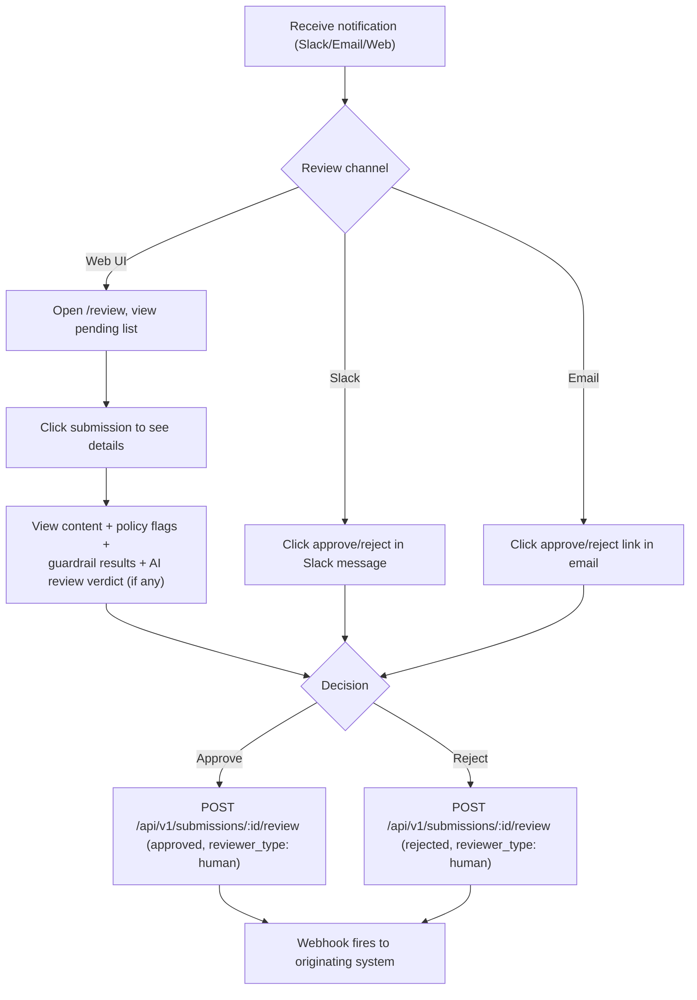
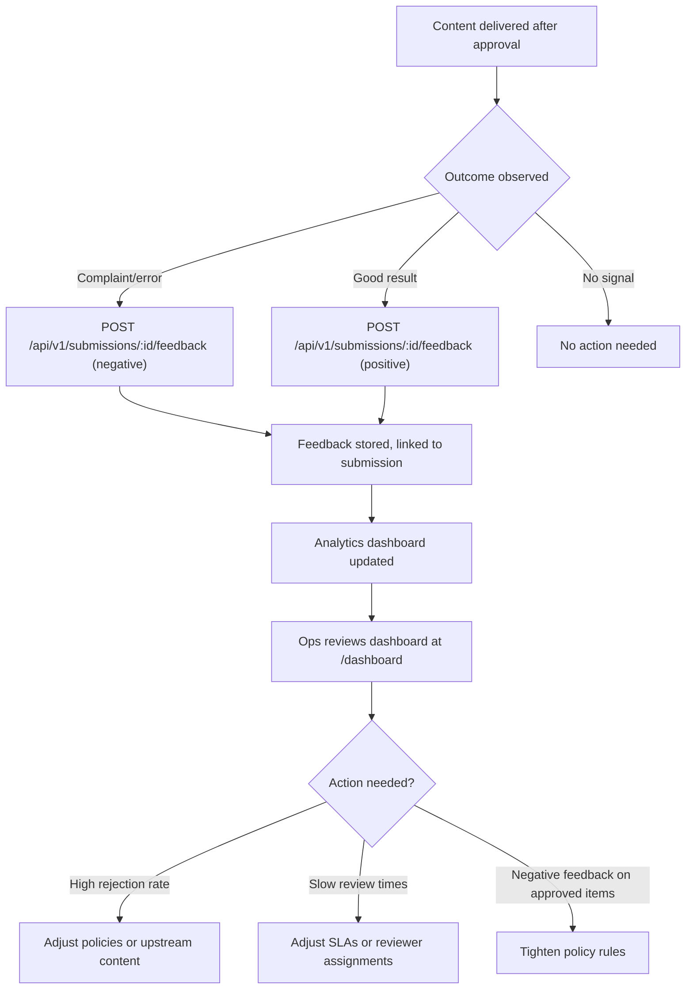
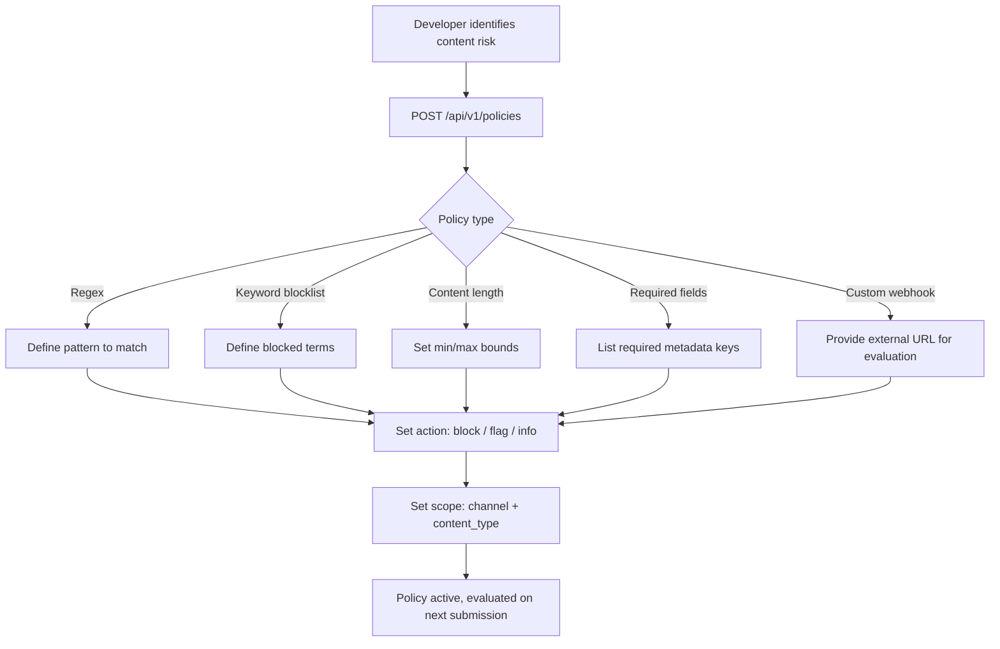

# UX Specification -- Greenlight

## User Flows

### Flow 1: Content Submission (Developer / Automated System) -- REQ-001, REQ-002, REQ-013, REQ-014, REQ-015

```mermaid
flowchart TD
    A["System produces content"] --> B["POST /api/v1/submissions"]
    B --> C{"Tier 1: Policy evaluation"}
    C -->|All pass| D{"Guardrail pipeline enabled?"}
    C -->|Flag triggered| D
    C -->|Block triggered| F["Auto-rejected (sync 201)"]
    D -->|No| G{"Review mode?"}
    D -->|Yes| E{"Tier 2: Guardrail pipeline"}
    E -->|All pass| G
    E -->|Fail (fail_closed)| F
    E -->|Flag| G
    G -->|human_only| H["Pending human review (sync 201)"]
    G -->|ai_only or ai_then_human| I["Pending AI review (sync 201)"]
    G -->|No review needed (all pass)| J["Auto-approved (sync 201)"]
    I --> K["BullMQ: AI review job"]
    K --> L{"AI verdict"}
    L -->|Approve (high confidence)| M["Decision webhook to callback_url"]
    L -->|Reject (high confidence)| M
    L -->|Escalate (low confidence)| H
    H --> N["Notification sent to reviewer"]
    N --> O{"Reviewer acts?"}
    O -->|Yes| M
    O -->|No, SLA expires| P{"Escalation configured?"}
    P -->|Yes| Q["Escalation notification sent"]
    P -->|No| R["Stays pending, visible in dashboard"]
    Q --> O
    J --> S["System proceeds with content"]
    M -->|Approved| S
    M -->|Rejected| T["System handles rejection"]
    F --> T
```

### Flow 2: Human Review (Reviewer) -- REQ-007, REQ-008, REQ-009



**Note:** When a submission arrives via AI escalation (ai_then_human mode), the human reviewer sees the AI's verdict, confidence score, and reasoning alongside the policy flags and guardrail results. This gives the human reviewer full context for their decision.

### Flow 3: Analytics and Feedback (Developer / Ops) -- REQ-004, REQ-005, REQ-010



### Flow 4: Policy Configuration (Developer) -- REQ-003



## Key Screens

### Screen 1: Review Queue

**Satisfies:** REQ-009, NFR-009
**Purpose:** Shows all pending submissions that need human review. This is the primary screen for reviewers.
**Entry points:** Direct link from notification (email/Slack), or navigate to `/review` from nav.
**Key elements:**
- Pending submissions count in header
- Filter bar: by channel, priority, age
- Submission cards showing: content preview (truncated), channel, time since submitted, policy flags that triggered review, priority badge
- One-click approve/reject buttons on each card
- Expand to see full content + add comment

**States:**
- **Loading:** Skeleton cards (3 placeholder cards with pulsing animation)
- **Empty:** "No pending reviews -- all clear" with checkmark icon
- **Error:** "Could not load submissions. Retry." with retry button
- **Populated:** List of submission cards sorted by priority then age

**Wireframe:**

<div style="border:1px solid #ccc; padding:0; max-width:800px; font-family:sans-serif; overflow:hidden">
  <div style="background:#1a1a2e; color:white; padding:12px 16px; display:flex; justify-content:space-between; align-items:center">
    <b>Greenlight</b>
    <span style="display:flex; gap:16px"><a href="#" style="color:#8be9fd; text-decoration:none">Review</a> <a href="#" style="color:#ccc; text-decoration:none">Dashboard</a></span>
  </div>
  <div style="padding:16px">
    <div style="display:flex; justify-content:space-between; align-items:center; margin-bottom:16px">
      <h2 style="margin:0">Pending Reviews <span style="background:#ff6b6b; color:white; padding:2px 8px; border-radius:12px; font-size:14px">3</span></h2>
      <select style="padding:6px 12px; border:1px solid #ddd; border-radius:4px"><option>All channels</option></select>
    </div>
    <div style="border:1px solid #ffd43b; background:#fff9db; padding:12px; border-radius:8px; margin-bottom:12px">
      <div style="display:flex; justify-content:space-between; align-items:flex-start">
        <div>
          <span style="background:#ffd43b; color:#333; padding:1px 6px; border-radius:4px; font-size:11px; font-weight:bold">URGENT</span>
          <span style="color:#666; font-size:12px; margin-left:8px">email &middot; 5 min ago</span>
          <div style="margin-top:8px; font-size:14px"><b>Marketing newsletter Q2 launch</b></div>
          <div style="color:#666; font-size:13px; margin-top:4px">Flagged: keyword_blocklist (contains "guaranteed returns")</div>
        </div>
        <div style="display:flex; gap:8px">
          <button style="background:#51cf66; color:white; border:none; padding:8px 16px; border-radius:4px; cursor:pointer">Approve</button>
          <button style="background:#ff6b6b; color:white; border:none; padding:8px 16px; border-radius:4px; cursor:pointer">Reject</button>
        </div>
      </div>
    </div>
    <div style="border:1px solid #ddd; padding:12px; border-radius:8px; margin-bottom:12px">
      <div style="display:flex; justify-content:space-between; align-items:flex-start">
        <div>
          <span style="background:#e3e3e3; color:#333; padding:1px 6px; border-radius:4px; font-size:11px; font-weight:bold">NORMAL</span>
          <span style="color:#666; font-size:12px; margin-left:8px">slack &middot; 12 min ago</span>
          <div style="margin-top:8px; font-size:14px"><b>Customer response -- refund request #4821</b></div>
          <div style="color:#666; font-size:13px; margin-top:4px">Flagged: content_length (exceeds 2000 chars)</div>
        </div>
        <div style="display:flex; gap:8px">
          <button style="background:#51cf66; color:white; border:none; padding:8px 16px; border-radius:4px; cursor:pointer">Approve</button>
          <button style="background:#ff6b6b; color:white; border:none; padding:8px 16px; border-radius:4px; cursor:pointer">Reject</button>
        </div>
      </div>
    </div>
    <div style="border:1px solid #ddd; padding:12px; border-radius:8px; margin-bottom:12px">
      <div style="display:flex; justify-content:space-between; align-items:flex-start">
        <div>
          <span style="background:#e3e3e3; color:#333; padding:1px 6px; border-radius:4px; font-size:11px; font-weight:bold">NORMAL</span>
          <span style="color:#666; font-size:12px; margin-left:8px">sms &middot; 28 min ago</span>
          <div style="margin-top:8px; font-size:14px"><b>Appointment reminder batch (47 recipients)</b></div>
          <div style="color:#666; font-size:13px; margin-top:4px">Flagged: custom_webhook (external compliance check inconclusive)</div>
        </div>
        <div style="display:flex; gap:8px">
          <button style="background:#51cf66; color:white; border:none; padding:8px 16px; border-radius:4px; cursor:pointer">Approve</button>
          <button style="background:#ff6b6b; color:white; border:none; padding:8px 16px; border-radius:4px; cursor:pointer">Reject</button>
        </div>
      </div>
    </div>
  </div>
</div>

### Screen 2: Submission Detail

**Satisfies:** REQ-008, REQ-009, REQ-013 (AI review display), REQ-014 (guardrail results display), REQ-015 (tiered results)
**Purpose:** Full view of a single submission with content, policy results, and review controls. Accessed by clicking a submission card.
**Entry points:** Click submission card in Review Queue, direct link from notification
**Key elements:**
- Full content display (rendered HTML for text/html, formatted JSON for application/json, plain text otherwise)
- Policy evaluation results (each policy that ran, its result, and details)
- Metadata table (key-value pairs from the submission)
- Review action area: approve/reject buttons + comment textarea
- Audit trail for this submission (all events)

**States:**
- **Loading:** Spinner centered on page
- **Error:** "Submission not found" or "Failed to load"
- **Populated (pending):** Full content with active approve/reject buttons
- **Populated (decided):** Full content with decision badge, review comment, reviewer identity. Buttons disabled.

**Wireframe:**

<div style="border:1px solid #ccc; padding:0; max-width:800px; font-family:sans-serif; overflow:hidden">
  <div style="background:#1a1a2e; color:white; padding:12px 16px; display:flex; justify-content:space-between; align-items:center">
    <span><a href="#" style="color:#8be9fd; text-decoration:none">&larr; Back to queue</a></span>
    <b>Submission Detail</b>
    <span>&nbsp;</span>
  </div>
  <div style="padding:16px">
    <div style="display:flex; justify-content:space-between; align-items:center; margin-bottom:16px">
      <div>
        <span style="background:#ffd43b; color:#333; padding:2px 8px; border-radius:4px; font-size:12px; font-weight:bold">PENDING</span>
        <span style="color:#666; font-size:13px; margin-left:8px">email &middot; Submitted 5 min ago</span>
      </div>
    </div>
    <h3 style="margin:0 0 8px">Content</h3>
    <div style="background:#f8f9fa; border:1px solid #dee2e6; padding:12px; border-radius:4px; margin-bottom:16px; font-size:14px; white-space:pre-wrap">Dear valued customer,

We are excited to announce our Q2 product launch with guaranteed returns on your investment...

[Content continues...]</div>
    <h3 style="margin:0 0 8px">Policy Results</h3>
    <table style="width:100%; border-collapse:collapse; margin-bottom:16px">
      <tr style="background:#f5f5f5">
        <th style="text-align:left; padding:8px; border-bottom:1px solid #ddd">Policy</th>
        <th style="text-align:left; padding:8px; border-bottom:1px solid #ddd">Result</th>
        <th style="text-align:left; padding:8px; border-bottom:1px solid #ddd">Details</th>
      </tr>
      <tr>
        <td style="padding:8px; border-bottom:1px solid #eee">keyword_blocklist</td>
        <td style="padding:8px; border-bottom:1px solid #eee"><span style="background:#ffd43b; padding:1px 6px; border-radius:4px; font-size:12px">FLAG</span></td>
        <td style="padding:8px; border-bottom:1px solid #eee">Matched: "guaranteed returns"</td>
      </tr>
      <tr>
        <td style="padding:8px; border-bottom:1px solid #eee">content_length</td>
        <td style="padding:8px; border-bottom:1px solid #eee"><span style="background:#51cf66; color:white; padding:1px 6px; border-radius:4px; font-size:12px">PASS</span></td>
        <td style="padding:8px; border-bottom:1px solid #eee">Length: 847 chars (limit: 5000)</td>
      </tr>
      <tr>
        <td style="padding:8px; border-bottom:1px solid #eee">required_fields</td>
        <td style="padding:8px; border-bottom:1px solid #eee"><span style="background:#51cf66; color:white; padding:1px 6px; border-radius:4px; font-size:12px">PASS</span></td>
        <td style="padding:8px; border-bottom:1px solid #eee">All required metadata present</td>
      </tr>
    </table>
    <h3 style="margin:0 0 8px">Guardrail Results</h3>
    <table style="width:100%; border-collapse:collapse; margin-bottom:16px">
      <tr style="background:#f5f5f5">
        <th style="text-align:left; padding:8px; border-bottom:1px solid #ddd">Guardrail</th>
        <th style="text-align:left; padding:8px; border-bottom:1px solid #ddd">Verdict</th>
        <th style="text-align:left; padding:8px; border-bottom:1px solid #ddd">Confidence</th>
        <th style="text-align:left; padding:8px; border-bottom:1px solid #ddd">Reasoning</th>
      </tr>
      <tr>
        <td style="padding:8px; border-bottom:1px solid #eee">Content Safety (Llama Guard)</td>
        <td style="padding:8px; border-bottom:1px solid #eee"><span style="background:#51cf66; color:white; padding:1px 6px; border-radius:4px; font-size:12px">PASS</span></td>
        <td style="padding:8px; border-bottom:1px solid #eee">0.97</td>
        <td style="padding:8px; border-bottom:1px solid #eee">No harmful content detected</td>
      </tr>
      <tr>
        <td style="padding:8px; border-bottom:1px solid #eee">PII Scanner (Guardrails AI)</td>
        <td style="padding:8px; border-bottom:1px solid #eee"><span style="background:#ffd43b; padding:1px 6px; border-radius:4px; font-size:12px">FLAG</span></td>
        <td style="padding:8px; border-bottom:1px solid #eee">0.72</td>
        <td style="padding:8px; border-bottom:1px solid #eee">Possible email address in body text</td>
      </tr>
    </table>
    <h3 style="margin:0 0 8px">AI Review</h3>
    <div style="background:#e7f5ff; border:1px solid #74c0fc; padding:12px; border-radius:8px; margin-bottom:16px">
      <div style="display:flex; justify-content:space-between; align-items:center; margin-bottom:8px">
        <span style="font-weight:bold">AI Verdict: <span style="background:#ffd43b; padding:1px 8px; border-radius:4px">ESCALATED</span></span>
        <span style="color:#666; font-size:12px">Confidence: 0.62 (threshold: 0.80)</span>
      </div>
      <div style="color:#495057; font-size:13px">Content appears promotional and may contain financial claims. AI is not confident enough to auto-approve. Escalated for human review.</div>
    </div>
    <h3 style="margin:0 0 8px">Your Review</h3>
    <textarea style="width:100%; height:60px; border:1px solid #ddd; border-radius:4px; padding:8px; font-size:14px; box-sizing:border-box; margin-bottom:12px" placeholder="Optional comment..."></textarea>
    <div style="display:flex; gap:12px">
      <button style="background:#51cf66; color:white; border:none; padding:10px 24px; border-radius:4px; cursor:pointer; font-size:14px; font-weight:bold">Approve</button>
      <button style="background:#ff6b6b; color:white; border:none; padding:10px 24px; border-radius:4px; cursor:pointer; font-size:14px; font-weight:bold">Reject</button>
    </div>
  </div>
</div>

**Note:** The Guardrail Results and AI Review sections only appear when the submission has been processed by those tiers. Submissions that were auto-approved by rules alone will not show these sections.

### Screen 3: Analytics Dashboard

**Satisfies:** REQ-004 (visual), REQ-005 (feedback display), REQ-010
**Purpose:** Read-only dashboard showing approval metrics and trends. For operations/compliance monitoring.
**Entry points:** Navigate to `/dashboard` from nav
**Key elements:**
- Summary metric cards: total submissions (period), approval rate, avg review time, SLA compliance
- Submissions volume chart (bar chart, daily)
- Top rejection reasons (horizontal bar chart)
- Channel breakdown (pie/donut chart)
- Feedback summary (positive/negative/neutral counts)
- Time range selector (24h / 7d / 30d / custom)

**States:**
- **Loading:** Skeleton metric cards + empty chart areas with loading spinners
- **Empty:** "No data for this period" with suggestion to adjust time range
- **Error:** "Failed to load analytics. Retry."
- **Populated:** All charts and metrics rendered with data

**Wireframe:**

<div style="border:1px solid #ccc; padding:0; max-width:800px; font-family:sans-serif; overflow:hidden">
  <div style="background:#1a1a2e; color:white; padding:12px 16px; display:flex; justify-content:space-between; align-items:center">
    <b>Greenlight</b>
    <span style="display:flex; gap:16px"><a href="#" style="color:#ccc; text-decoration:none">Review</a> <a href="#" style="color:#8be9fd; text-decoration:none">Dashboard</a></span>
  </div>
  <div style="padding:16px">
    <div style="display:flex; justify-content:space-between; align-items:center; margin-bottom:16px">
      <h2 style="margin:0">Analytics</h2>
      <select style="padding:6px 12px; border:1px solid #ddd; border-radius:4px"><option>Last 7 days</option></select>
    </div>
    <div style="display:grid; grid-template-columns:1fr 1fr 1fr 1fr; gap:12px; margin-bottom:24px">
      <div style="border:1px solid #ddd; padding:16px; text-align:center; border-radius:8px">
        <div style="font-size:28px; font-weight:bold">1,247</div>
        <div style="color:#666; font-size:13px">Total Submissions</div>
      </div>
      <div style="border:1px solid #ddd; padding:16px; text-align:center; border-radius:8px">
        <div style="font-size:28px; font-weight:bold; color:#51cf66">94.2%</div>
        <div style="color:#666; font-size:13px">Approval Rate</div>
      </div>
      <div style="border:1px solid #ddd; padding:16px; text-align:center; border-radius:8px">
        <div style="font-size:28px; font-weight:bold">4m 12s</div>
        <div style="color:#666; font-size:13px">Avg Review Time</div>
      </div>
      <div style="border:1px solid #ddd; padding:16px; text-align:center; border-radius:8px">
        <div style="font-size:28px; font-weight:bold; color:#339af0">97.1%</div>
        <div style="color:#666; font-size:13px">SLA Compliance</div>
      </div>
    </div>
    <div style="display:grid; grid-template-columns:2fr 1fr; gap:16px; margin-bottom:24px">
      <div style="border:1px solid #ddd; padding:16px; border-radius:8px">
        <h3 style="margin:0 0 12px; font-size:15px">Submissions Volume (7d)</h3>
        <div style="height:120px; background:#f8f9fa; border-radius:4px; display:flex; align-items:flex-end; justify-content:space-around; padding:8px">
          <div style="width:12%; background:#339af0; height:60%; border-radius:2px 2px 0 0"></div>
          <div style="width:12%; background:#339af0; height:80%; border-radius:2px 2px 0 0"></div>
          <div style="width:12%; background:#339af0; height:45%; border-radius:2px 2px 0 0"></div>
          <div style="width:12%; background:#339af0; height:90%; border-radius:2px 2px 0 0"></div>
          <div style="width:12%; background:#339af0; height:70%; border-radius:2px 2px 0 0"></div>
          <div style="width:12%; background:#339af0; height:55%; border-radius:2px 2px 0 0"></div>
          <div style="width:12%; background:#339af0; height:100%; border-radius:2px 2px 0 0"></div>
        </div>
      </div>
      <div style="border:1px solid #ddd; padding:16px; border-radius:8px">
        <h3 style="margin:0 0 12px; font-size:15px">Top Rejection Reasons</h3>
        <div style="font-size:13px">
          <div style="margin-bottom:8px"><span>Blocked keywords</span><div style="background:#ff6b6b; height:8px; width:70%; border-radius:4px; margin-top:4px"></div></div>
          <div style="margin-bottom:8px"><span>Content too long</span><div style="background:#ffd43b; height:8px; width:40%; border-radius:4px; margin-top:4px"></div></div>
          <div style="margin-bottom:8px"><span>Missing metadata</span><div style="background:#ffd43b; height:8px; width:25%; border-radius:4px; margin-top:4px"></div></div>
          <div><span>Policy webhook reject</span><div style="background:#e3e3e3; height:8px; width:15%; border-radius:4px; margin-top:4px"></div></div>
        </div>
      </div>
    </div>
    <div style="border:1px solid #ddd; padding:16px; border-radius:8px">
      <h3 style="margin:0 0 12px; font-size:15px">Post-Delivery Feedback</h3>
      <div style="display:flex; gap:24px; font-size:14px">
        <span style="color:#51cf66; font-weight:bold">842 positive</span>
        <span style="color:#ff6b6b; font-weight:bold">23 negative</span>
        <span style="color:#868e96; font-weight:bold">156 neutral</span>
      </div>
    </div>
  </div>
</div>

## Mobile Considerations

- **Breakpoint:** Layout stacks to single column below 768px. Dashboard metric cards go to 2x2 grid on tablet, single column on phone.
- **Touch targets:** All approve/reject buttons >= 44x44px. Action links in notifications >= 44px touch area.
- **No horizontal scroll** at any viewport width >= 375px
- **Font sizes:** Body text >= 16px on mobile (prevents iOS zoom on focus)
- **Review Queue on mobile:** Cards stack full width. Approve/reject buttons become full-width row below content.
- **Dashboard on mobile:** Metric cards stack single column. Charts full width. Time selector at top.

## Accessibility

- **Keyboard navigation:** All interactive elements focusable and operable via keyboard. Tab through submission cards, Enter to expand, Tab to approve/reject buttons.
- **Screen reader:** Semantic HTML (headings, landmarks, labels). ARIA attributes for status badges and dynamic content updates. Live region for new submissions arriving in queue.
- **Color contrast:** WCAG AA (4.5:1 for normal text, 3:1 for large text). Status indicators use both color AND text/icon (not color alone).
- **Motion:** Respect `prefers-reduced-motion`. Auto-refresh does not cause layout shift.
- **Focus management:** After approve/reject, focus moves to next pending submission card.

## Performance Expectations

- **Time to interactive:** < 2s on broadband for Review Queue and Dashboard
- **First contentful paint:** < 1s
- **Auto-refresh:** Dashboard polls every 30s without full page reload (partial DOM update)
- **Review Queue update:** New submissions appear within 5s of creation (polling or SSE)
